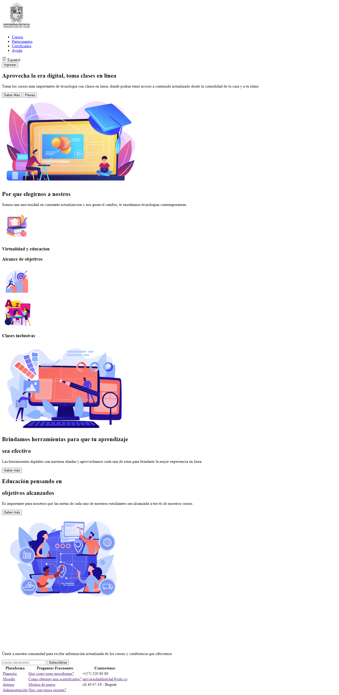
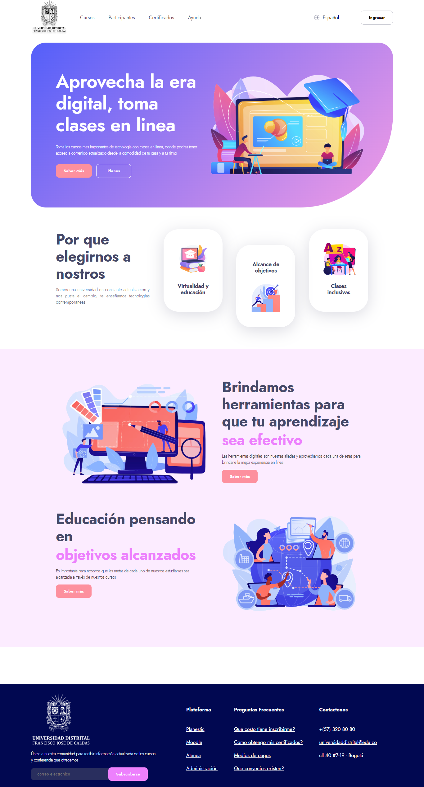

<h1>Taller 9: Yousef Junco</h1>

<h2>Informacion</h2>

Curso: Full Stack Basico Grupo 1

Profesor: Cristian Patio

<h2>Punto 1: Link de figma</h2>
<a href="https://www.figma.com/file/H8IR92mqhQcLXEjf0n84rq/Untitled?type=design&node-id=0%3A1&t=ZAIUG4VWBoXBxsp0-1">Link de Figma</a>

<h2>Link pagina web</h2>
<a href="https://yajf98.github.io/Taller-9-Full-Stack/">pagina web</a>

<h2>Punto 2: HTML</h2>

<h2>Punto 3: CSS</h2>

<h2>Punto 4: HTML y CSS</h2>

<h2>Punto 5: HTML y CSS</h2>

<h2>Punto 6: HTML y CSS</h2>

<h2>Punto 7-8: HTML y CSS</h2>

<h2>Punto 9: HTML y CSS</h2>
